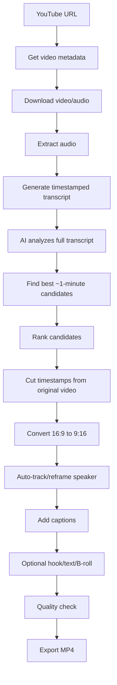
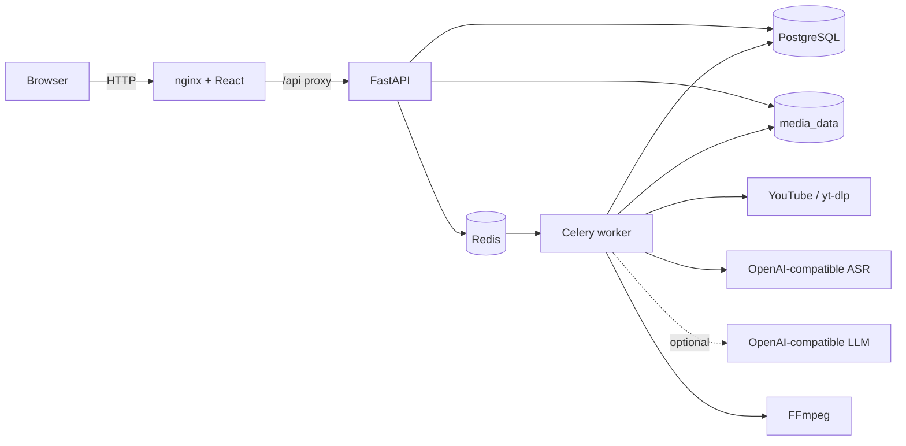
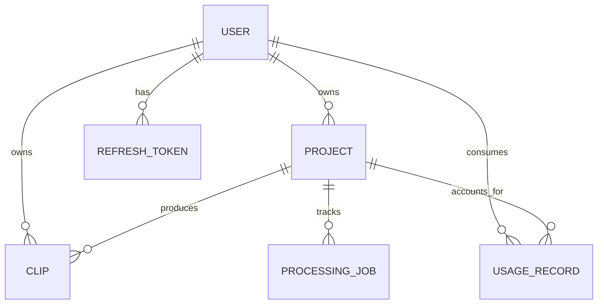
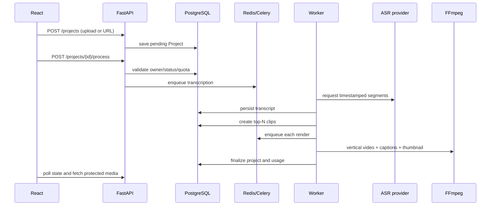
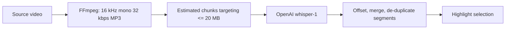

# ClipForge Architecture

This describes the implementation present on 2026-08-29. Proposed changes are explicitly labelled; they are not current behavior.

## Product boundary

The MVP accepts an uploaded video or YouTube video URL, transcribes its audio, selects a small number of transcript-backed highlights, and renders 9:16 captioned clips. Selection is top-N useful moments, not exhaustive consecutive one-minute slices. Code targets about 60 seconds per highlight within 40–90 seconds.

## Target product pipeline

The intended YouTube flow supplied for this review is:

Current implementation coverage:

| Target stage | Current implementation | Status |
|---|---|---|
| YouTube URL | URL project and yt-dlp integration | Implemented, validation too broad |
| Metadata before download | yt-dlp metadata is read as part of a download operation; limits follow download | Gap |
| Download | Worker downloads and stores source | Implemented |
| Extract audio | FFmpeg creates 16 kHz mono, 32 kbps MP3 | Implemented |
| Timestamped transcript | `whisper-1` segments; audio over 20 MB is split and timestamps offset | Implemented; real long-form E2E unverified |
| Analyze full transcript | Optional LLM; deterministic heuristic without an LLM key | Partial |
| Find/rank ~1-minute candidates | Top-eight scoring, 40–90 second bounds | Implemented with boundary defects |
| Cut original video | FFmpeg seeks to candidate timestamps | Implemented |
| Convert to 9:16 | Fixed center crop, then scale/pad to 1080×1920 | Implemented |
| Auto-track/reframe speaker | No subject detection or dynamic crop path | Missing |
| Captions | Timestamp-sliced SRT burned into MP4 | Implemented |
| Hook/text/B-roll | Caption styling only | Optional stage not implemented |
| Quality check | FFmpeg failure is detected; no output/content QC | Missing |
| Export MP4 | Authenticated preview/download | Implemented |

For MVP scope, “quality check” still needs an explicit minimum contract. The code currently proves only that FFmpeg returned successfully, not that output has valid duration, resolution, audio, readable captions, or a visible subject. “Hook/text/B-roll if needed” is conditional and should not block the base captioned-short MVP unless made an acceptance criterion.

## Verified technical context

| Area | Detected context | Status |
|---|---|---|
| Backend | Python 3.11, FastAPI, SQLAlchemy 2, Alembic | Verified |
| Background work | Celery with Redis | Verified |
| Persistence | PostgreSQL 15; SQLite in tests | Verified |
| Frontend | React 18, TypeScript 5.7, Vite 6, TanStack Query | Verified |
| Media | FFmpeg/ffprobe and yt-dlp | Verified |
| Storage | Local filesystem abstraction/shared Docker volume | Verified |
| Default ASR | OpenAI-compatible transcription API, `whisper-1` | Verified |
| Highlights | LLM when configured; deterministic heuristic otherwise | Verified |
| Deployment | Docker Compose, nginx, GitHub Actions | Verified |

## System view

The browser never gets a volume path. It fetches videos/thumbnails through authenticated API endpoints; the frontend converts responses into short-lived object URLs.

## Components

### React frontend

Provides authentication, dashboard/project flows, status polling, clip preview/download/delete/regeneration, profile, and usage. Axios owns authentication/refresh; TanStack Query owns cache and active-state polling. Publishing components exist but are not mounted in `App.tsx`.

### FastAPI API

Routers validate HTTP input and delegate to services. Services own authentication, projects, quota reads, media probing/cleanup, and clips. Requests persist state and enqueue work; they do not transcribe/render synchronously.

### Celery worker

1. `transcribe_project_task` optionally downloads YouTube, calls ASR, and stores timestamped segments.
2. `detect_highlights_task` selects top-N candidates, creates clips, and enqueues renders.
3. `render_clip_task` crops/pads to 1080×1920, burns synchronized SRT captions, and creates a thumbnail.
4. Finalization marks the project ready/failed and records usage after all sibling clips terminate.

Tasks catch errors and persist application failure state instead of re-raising for Celery retry.

### Data model

- `Project`: source metadata, pipeline state, source key, transcript segments, errors.
- `Clip`: source window, score, caption style, media keys, state.
- `ProcessingJob`: transcription/highlight/render attempt audit.
- `UsageRecord`: processed minutes and generated clips.
- `RefreshToken`: issued tokens for rotation/revocation.

Publishing models exist but are outside the active MVP.

### Media storage

`LocalMediaStorage` creates randomized upload keys, validates resolved paths stay under the media root, and deletes owned files. API and worker mount the same volume. This is appropriate for a single-host MVP; multiple hosts require common object/filesystem storage.

## Core flow

For URL projects, creation stores the URL without a local path. The worker later downloads with yt-dlp, moves successful output into media storage, then follows the upload flow.

## State models

Normal project path: `pending → transcribing → analyzing → rendering → ready`. Any task can produce `failed`. Restarting a ready/failed project clears the generated prior run.

Normal clip path: `queued → rendering → ready`; failure produces `failed`, and regeneration returns to `queued`.

## Security boundary

- bcrypt password hashes and signed access/refresh JWTs.
- Authenticated, ownership-filtered project/clip/media/usage access.
- Rotating/revocable refresh tokens, although full bearer tokens are currently stored in the database (a review finding).
- Environment-provided secrets and gitignored `.env`.

## Failure and recovery

- Typed API errors become JSON responses.
- Worker failures update jobs/projects/clips.
- A project is ready if at least one render succeeds; all-failed becomes failed.
- Deletion cleans source/generated files with shared-reference checks.
- No automatic task retry, dead-letter handling, cancellation, hard time limits, or stale-job reconciliation exists.
- Queue publication is not transactional with database commits, so persisted queued state can lose its work message.

## Known MVP limitations

1. Long-form ASR extracts audio and creates estimated sub-25 MB chunks, but chunks have no overlap/context and actual encoded chunk size is not rechecked before upload. A real long-form provider run is unverified.
2. Highlight boundaries are unreliable without terminal punctuation, and LLM timestamps are not snapped to transcript boundaries.
3. Concurrent process/regeneration/finalization operations are not fully idempotent.
4. YouTube validation accepts some non-video shapes and failed downloads can leak temporary files.
5. Quotas are checked but not reserved, so accepted jobs can exceed limits.
6. Local storage is for a single-host MVP, not horizontal deployment.
7. Publishing is deliberately unavailable.
8. The target speaker-tracking/reframing and automated output quality-check stages do not exist; rendering uses a fixed center crop.

See [CODE_REVIEW.md](CODE_REVIEW.md) for evidence and fixes.

## Current ASR path

This path is implemented. Chunk joins apply time offsets but no overlap/de-duplication or prompt context, so speech at a cut boundary can lose continuity. For private/offline ASR, the existing `TranscriptionService` could call local faster-whisper or whisper.cpp. Ollama/Ollama Cloud may fit text-only highlight ranking; it is not the ASR used here and is not a verified drop-in transcription provider.

## Deployment

Compose runs PostgreSQL, Redis, one-shot Alembic migration, FastAPI, Celery worker, and nginx-hosted React. API/worker share `media_data`; PostgreSQL uses `postgres_data`. Backups, TLS, monitoring, autoscaling, and production secret management are not defined.
